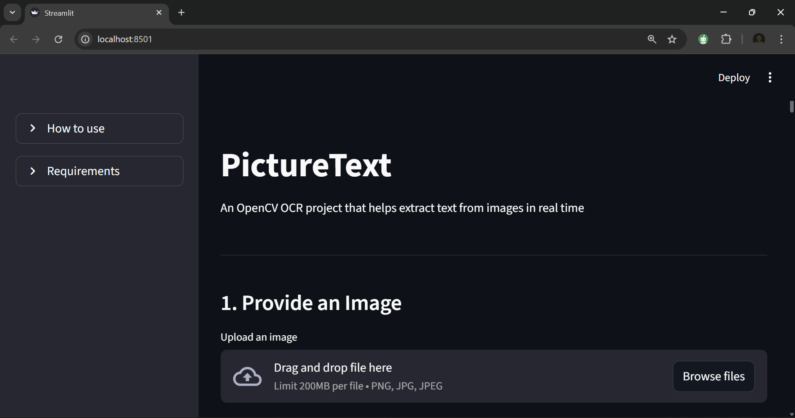

# PictureText

*PictureText* is a Python-based OCR application that extracts text from images using Tesseract OCR and OpenCV. It features a modern Streamlit web interface and optional AI-powered text enhancement.

---

## Features

- **Web Interface**: User-friendly Streamlit dashboard for easy image uploads
- **Image Preprocessing**: Advanced OpenCV processing with adaptive thresholding and denoising
- **Text Extraction**: High-accuracy OCR using Tesseract engine
- **AI Enhancement**: Optional Claude AI integration to correct OCR errors and improve text quality
- **Multi-Language Support**: Tesseract supports multiple languages for diverse use cases
- **Real-Time Preview**: View original and processed images side-by-side

---

## Requirements

- Python 3.8+
- Tesseract OCR (installed locally on your system)
- Required Python packages:
  - streamlit
  - opencv-python
  - pytesseract
  - Pillow
  - anthropic (for AI enhancement)

---

## Installation

### 1. Clone the Repository
```bash
git clone https://github.com/Wobo-bright/PictureText.git
cd PictureText
```

### 2. Install Tesseract OCR
```bash
# Ubuntu/Debian
sudo apt-get install tesseract-ocr

# macOS
brew install tesseract

# Windows: Download from github.com/UB-Mannheim/tesseract/wiki
```

### 3. Install Python Dependencies
```bash
pip install -r requirements.txt
```

### 4. (Optional) Configure AI Enhancement
Create `.streamlit/secrets.toml` for AI-powered text correction:
```toml
GROQ_API_KEY = "your-api-key"
```
Get your API key at [console.groq.com](https://console.groq.com/keys)

---

## Usage

### 1. Run the Application
```bash
streamlit run main.py
```
The app will open in your browser at `http://localhost:8501`

### 2. Extract Text
1. Upload an image (PNG, JPG, or JPEG)
2. Click **"Extract Text"** to process the image
3. View the processed image and extracted text
4. (Optional) Click **"Enhance text with AI"** to correct OCR errors

### How it looks like


---

## Project Structure

```
PictureText/
├── main.py              # Streamlit web interface
├── computer_vision.py   # Image preprocessing with OpenCV
├── extraction.py        # OCR text extraction with Tesseract
├── requirements.txt     # Python dependencies
└── .streamlit/
    └── secrets.toml     # API keys (not in git)
```

---

## Tips for Best Results

- Use high-resolution images (300+ DPI recommended)
- Ensure good contrast between text and background
- Keep images well-lit and avoid shadows
- Works best with printed text; handwriting recognition is limited

---

## Contributing

Contributions to *PictureText* are welcome! If you have ideas for improvements, new features, or bug fixes, feel free to open an issue or submit a pull request.

---
##Live site
Check it out here https://picturetext.streamlit.app/
## License

*PictureText* is licensed under the [MIT License](LICENSE).

---
